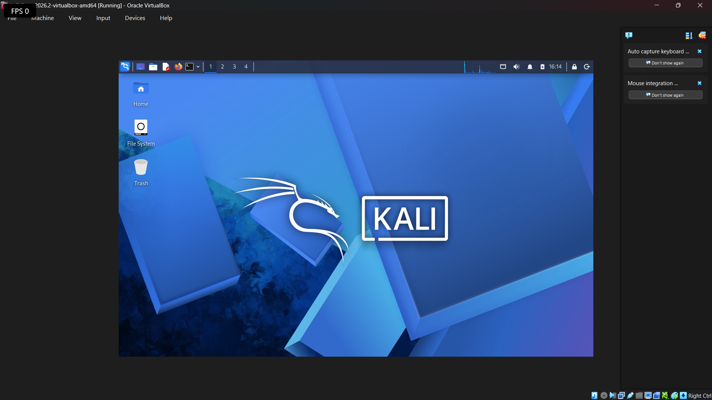
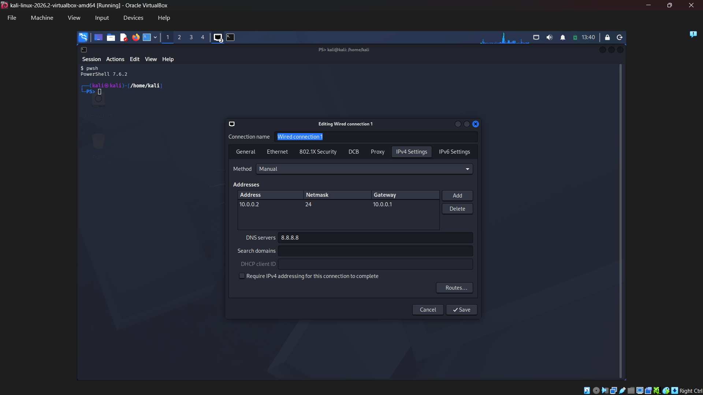
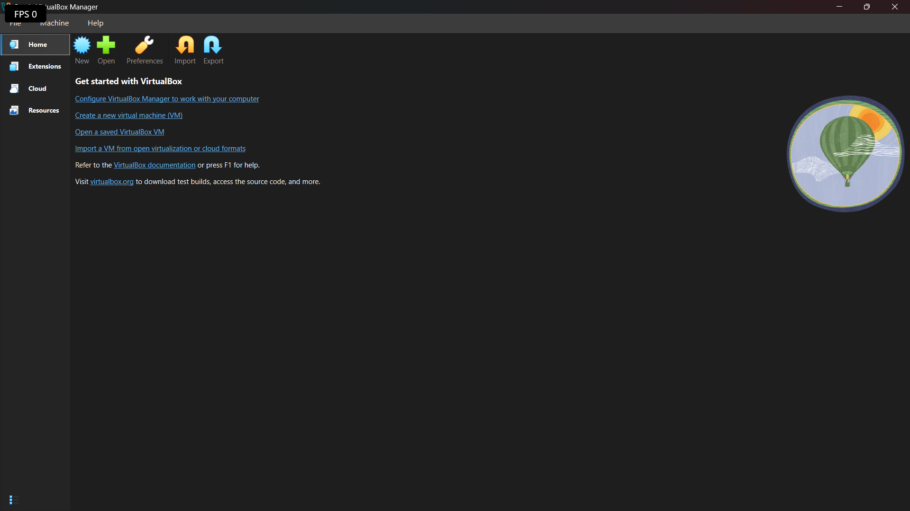
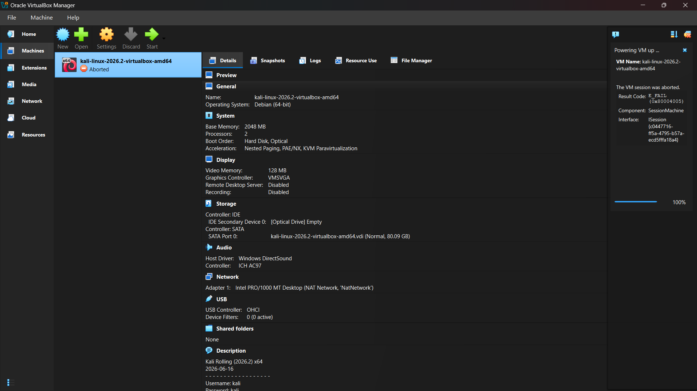

# Cybersecurity Lab Setup — VirtualBox + Kali Linux

This repo documents how I set up my own isolated cybersecurity lab using VirtualBox and Kali Linux, as part of Week 1 of the NetworkWalks Cybersecurity program.

Nothing fancy here — just VirtualBox, a NAT Network, and a Kali VM sitting on it. But I ran into a few annoying issues along the way (mainly around VirtualBox hiding the Network tool, and Kali randomly aborting on startup), so I wanted to write those down properly in case anyone else in the batch hits the same wall.

**Author:** Sayan Dutta **Batch:** B083, NetworkWalks

---

## Why I built this

Before jumping into actual pentesting tools and techniques, we needed a safe place to practice — somewhere isolated from my real home network where I could scan, poke around, and eventually break things without worrying about actually breaking anything important.

So the goal was simple: get Kali Linux running inside VirtualBox, on its own private network, with an IP I control. Later on I'll probably add more VMs to this same network to use as targets.

A quick note before anything else — this lab is for learning and for testing systems I own. Not pointing any of this at anything else.

---

## What's actually in this lab

| Component    | Value             |
| ------------ | ----------------- |
| Hypervisor   | Oracle VirtualBox |
| Guest OS     | Kali Linux 2026.2 |
| Network type | NAT Network       |
| Network name | NatNetwork        |
| Subnet       | 10.0.0.0/24       |
| Kali's IP    | 10.0.0.2/24       |
| Gateway      | 10.0.0.1          |
| DNS          | 8.8.8.8           |

Leaving 10.0.0.3–10.0.0.99 free for whatever target VMs I add down the line.

---

## How I set it up

### 1. Installed WinRAR first

Kali's VM files usually come compressed, so WinRAR was step zero — needed it to actually extract the download before doing anything else.

### 2. Installed VirtualBox

Straightforward install. The one thing worth mentioning: right after installing, VirtualBox asks you to pick between **Basic Mode** and **Expert Mode**. This choice matters more than it seems — more on that in the problems section below, because it's literally what caused issue #1.

### 3. Created the NAT Network

Went with:

```
Network Name: NatNetwork
IPv4 Prefix:  10.0.0.0/24
DHCP:         Enabled
IPv6:         Disabled
```

I picked NAT Network specifically (not regular NAT) because it lets multiple VMs on the same network talk to each other while still reaching the internet. Since I plan on adding more VMs later to attack/scan, this matters — plain NAT would isolate each VM from the others.

### 4. Imported Kali Linux

Downloaded the Kali VM from the official site and imported it into VirtualBox. Set the network adapter like this:

```
Adapter 1
Attached to:  NAT Network
Network:      NatNetwork
```

Here's Kali booted up for the first time on the new network:

[](1-screenshot-kali-desktop.png)

### 5. Set a static IP on Kali

By default Kali just grabs whatever DHCP hands it, but I wanted something fixed so I don't have to keep checking the IP every time I boot the machine. Went into the Network Manager GUI on Kali and set it manually:

```
Method:      Manual
Address:     10.0.0.2
Netmask:     24
Gateway:     10.0.0.1
DNS:         8.8.8.8
```

[](4-screenshot-kali-manual-ip.png)

### 6. Took a snapshot

Once everything looked good and the network was working, I took a snapshot called `Clean Kali - Network Setup`. If I mess something up in later labs (which, let's be honest, is likely), I can just roll back to this instead of redoing the whole thing.

---

## Checking that everything actually works

Ran through these to make sure the network was actually behaving:

| Check               | Command                     | What I expected   |
| ------------------- | --------------------------- | ----------------- |
| IP is set correctly | `ip a`                      | Shows 10.0.0.2/24 |
| Gateway reachable   | `ping 10.0.0.1`             | Replies           |
| Internet works      | `ping 8.8.8.8`              | Replies           |
| DNS resolves        | `nslookup networkwalks.com` | Resolves fine     |
| Nmap installed      | `nmap --version`            | Shows version     |
| Snapshot restores   | Restore + `ip a`            | Back to 10.0.0.2  |

All of these came back clean on my setup.

---

## Problems I ran into (and how I got past them)

### Problem 1 — VirtualBox wouldn't show me the Network tool at all

So this was the first annoying one. Right after installing VirtualBox and opening it up, I went looking for the Network option under Tools to set up my NAT Network — and it just wasn't there. My sidebar only had:

```
Home
Machines
Extensions
Cloud
Resources
```

No Network option anywhere. Took me a bit to realize this was because VirtualBox had defaulted to **Basic Mode** on install (there's a popup asking Basic vs Expert the very first time you open it, and I'd clicked past it without thinking too much).

**Fix:** Went into Preferences, switched the Experience Mode from Basic to Expert, and restarted VirtualBox. After that, Network showed up in the Tools sidebar like it was supposed to.

VirtualBox Manager after switching to Expert Mode — Network now shows up in the sidebar:

[](2-screenshot-virtualbox-mode.png)

### Problem 2 — Network Manager was still missing, even in Expert Mode (on a different machine)

This one was more confusing. On my Windows 11 machine running VirtualBox 7.2.16, I'd already switched to Expert Mode, restarted, did everything "right" — and the Network tool under Tools was *still* not showing up. At this point I genuinely thought the install was broken.

Instead of reinstalling (which felt like a nuke-it-and-hope-for-the-best move), I decided to check things properly through PowerShell using VBoxManage before assuming the worst.

First, confirmed VirtualBox itself was fine:

```
& "C:\Program Files\Oracle\VirtualBox\VBoxManage.exe" --version
```

Got back `7.2.16r174877`, so the install was healthy.

Then checked if a NAT Network already existed (maybe it was there and just not showing):

```
VBoxManage list natnetworks
```

Nothing came back — so no, it wasn't a display bug hiding an existing network, it genuinely didn't exist yet.

Also checked host-only and bridged networking just to rule those out:

```
VBoxManage list hostonlyifs
VBoxManage list bridgedifs
```

Both looked fine — host-only adapter was up, and VirtualBox could see my Wi-Fi adapter too. So the underlying networking stack on the machine wasn't the issue.

I also checked whether some GUI setting was deliberately hiding the tool:

```
VBoxManage getextradata global enumerate
```

No `GUI/RestrictedNetworkAttachmentTypes` entry, so nothing was explicitly disabling it. Tried resetting the Tools panel selection too, just in case it was stuck on something weird:

```
VBoxManage setextradata global GUI/Tools/LastItemsSelected ""
```

Restarted VirtualBox again after that — still no Network tool in the sidebar. At this point I gave up trying to make the GUI show it.

**What actually fixed it:** I realized I didn't actually need the GUI tool — I just needed the NAT Network to exist and work. So I created it directly with VBoxManage instead:

```
& "C:\Program Files\Oracle\VirtualBox\VBoxManage.exe" natnetwork add --netname "NatNetwork" --network "10.0.0.0/24" --enable --dhcp on
```

And it worked immediately:

```
Name:         NatNetwork
Network:      10.0.0.0/24
Gateway:      10.0.0.1
DHCP Server:  Yes
IPv6:         No
```

From there, attaching the VM to it was just a normal setting in the VM's own Settings → Network screen (NAT Network shows up fine as an attachment option there, even though the standalone tool doesn't appear in the main Tools list). Or you can skip the GUI entirely:

```
& "C:\Program Files\Oracle\VirtualBox\VBoxManage.exe" modifyvm "VM_NAME" --nic1 natnetwork --nat-network1 "NatNetwork"
```

**Basically:** the missing Network entry in the Tools sidebar seems to just be a display quirk in this VirtualBox build — the feature itself works completely fine through the CLI, so it wasn't actually blocking anything. Good reminder not to assume something's broken just because a GUI button isn't where you expect it.

### Problem 3 — Kali VM randomly shows "Aborted" when I try to start it

This is the one that still catches me out every now and then. Sometimes when I hit **Start** on the Kali VM, it doesn't boot at all — the VM just flips to an **Aborted** state in the VirtualBox Manager, or the window opens and immediately closes. No warning beforehand, and it worked perfectly fine the last time I used it. No changes to the VM settings either, so it was confusing at first.

The error VirtualBox shows in the side panel is `The VM session was aborted` with `Result Code: E_FAIL (0x80004005)`:

[](5-screenshot-kali-aborted.png)

**What I think is going on:** on Windows 11, VirtualBox has to share the CPU's virtualization features with Windows' own hypervisor (Hyper-V, Virtual Machine Platform, Windows Hypervisor Platform, and Memory Integrity/Core Isolation all use it). Sometimes Windows takes control of the hypervisor layer — usually after an update or a restart — and VirtualBox can't get proper access to it, so the VM aborts on start. Restarting VirtualBox or the VM by itself didn't help, and neither did re-importing the VM.

**The fix that worked for me:** opened **PowerShell as Administrator** (right-click → Run as administrator) and ran commands to stop Windows' hypervisor from grabbing the virtualization layer:

```
bcdedit /set hypervisorlaunchtype off
```

And I also turned off the related Windows features:

```
dism.exe /Online /Disable-Feature:Microsoft-Hyper-V-All /NoRestart
dism.exe /Online /Disable-Feature:VirtualMachinePlatform /NoRestart
dism.exe /Online /Disable-Feature:HypervisorPlatform /NoRestart
```

Then **restarted the laptop** — this step matters, the changes don't take effect until the reboot. After it came back up, Kali started normally, no more Aborted state.

If you want to double check the setting took effect before rebooting:

```
bcdedit /enum | findstr hypervisorlaunchtype
```

It should show `hypervisorlaunchtype  Off`.

**Things worth knowing:**

- If you ever need Hyper-V, WSL2 or Docker Desktop again, you can flip it back with `bcdedit /set hypervisorlaunchtype auto` and a restart. Those tools and VirtualBox tend to fight over the same virtualization layer.
- Windows updates can quietly turn some of these features back on, which is probably why the problem comes back randomly.
- Also worth checking that virtualization (Intel VT-x / AMD-V) is enabled in BIOS, and that **Memory Integrity** (Windows Security → Device Security → Core isolation) isn't blocking VirtualBox.
- If the VM still aborts after all this, look at the VM log (right-click the VM → Show Log, or `VBox.log` in the VM folder). The last few lines usually say exactly why it died.

---

## Stuff I actually took away from this

- **Basic Mode vs Expert Mode matters more than I expected.** That one popup during install quietly decides what tools you can even see later.
- **NAT Network ≠ regular NAT.** Regular NAT isolates each VM; NAT Network lets multiple VMs on it talk to each other while still getting outbound internet — which is exactly what I'll need once I add more VMs.
- **Don't panic when a GUI option disappears.** Half of Problem 2 was me assuming something was broken when really the feature worked fine, just not through that particular button. `VBoxManage` ended up being more reliable than the GUI for this.
- **VirtualBox and Windows' own hypervisor don't always get along.** If a VM aborts for no obvious reason, check Hyper-V and related features before blaming the VM itself.
- **Static IPs make life easier for lab work** — no more checking `ip a` every time just to remember what address Kali landed on.
- **Snapshots before doing anything risky.** Cheap insurance against having to redo the entire setup.
- Writing all this down as I went actually helped me debug faster the second time something broke — turns out documentation isn't just busywork.

---

## Tools used

- WinRAR: <https://www.win-rar.com/download.html>
- VirtualBox: <https://virtualbox.org/wiki/Downloads>
- Kali Linux: <https://kali.org/get-kali>

---

**Sayan Dutta** — Batch B083, NetworkWalks Cybersecurity Program
